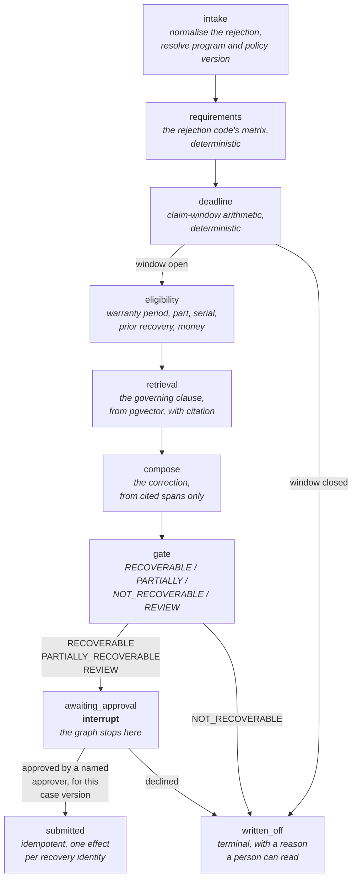
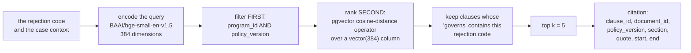
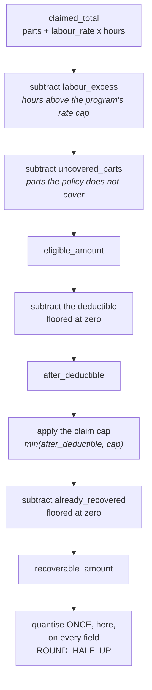
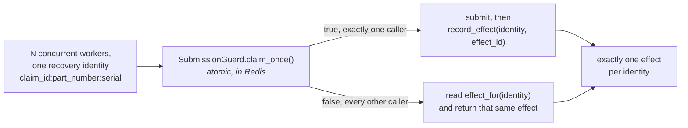
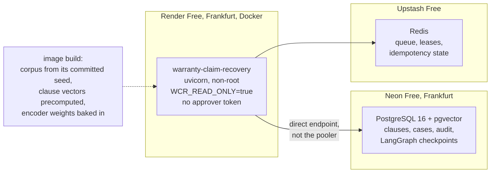

# Architecture

What the system is, in the order it runs, and where each of ADR-001's thirteen kill conditions is
actually decided. `DECISIONS.md` is authoritative; this document explains the machine and points at
the code and the artefact that grades each claim.

Every diagram here is mermaid rather than an image, for a reason that is not aesthetic: a rendered
diagram drifts from the system silently, because nobody can diff a PNG. A diagram in text appears in
the same review as the change that invalidated it.

---

## 1. The case machine

One LangGraph graph with a PostgreSQL checkpointer. Explicit nodes, explicit edges, and no routing
decided by model output. The node names are `CaseState` in `domain.py`, one to one — a state enum
that drifts from the graph's node names makes "resumes at the same node" a sentence nobody can
check, because the reader has to hold a mapping in their head and the mapping is where the error
hides.



### Why the order is the argument

**Everything deterministic happens before anything is retrieved.** `requirements`, `deadline` and
`eligibility` decide what the manufacturer demands, whether there is still time to answer, and what
the money is, using nothing but the claim, the program and arithmetic. Putting retrieval first
would make the expensive path — an embedding, a query, a composition — run for claims whose window
shut three weeks ago. Worse, it would make the money the second thing a reader checks rather than
the first, and the money is the part a manufacturer's adjudicator disputes.

**`deadline` can end the case on its own.** A claim whose correction window has closed goes to
`written_off` without retrieval, without composition and without ever reaching a submission path.
That edge is where kill condition M is enforced: the system cannot resubmit after the window closed
because there is no route from a closed window to `submitted`. M is then *measured* over the whole
corpus rather than assumed, because an edge that exists in a diagram and not in the graph is the
defect the measurement is for.

**`gate` runs after `compose`, and reads nothing `compose` produced.** This looks like an
inconsistency with the rule that no model decides the gate, and it is not. The gate's inputs are
`GateSignals` — window state, warranty period, part and serial eligibility, requirement counts,
prior recovery, whether the recoverable amount is positive — and every one of them is fixed before
`compose` runs. `compose` exists between them because a requirement becomes `SATISFIED` only when a
citation is attached to it, and the citation comes from retrieval. The rejected alternative was to
run `gate` before `compose` and re-run it afterwards: that gives two gate outcomes for one case, and
the audit log then has to explain which one authorised the submission.

**`awaiting_approval` is a real interrupt, not a flag on a row.** The graph stops, the state is
durable in PostgreSQL, and a different process on a different day resumes it. A boolean checked in a
loop would keep the worker alive across a wait that is measured in days, and the first restart would
lose it.

**`submitted` is reached from exactly one edge.** ADR-001 §4 claim 2 is that nothing leaves the
system without a recorded approval for the same case version. One inbound edge is what makes that
claim structural rather than aspirational; a second route to `submitted`, however well guarded,
would be a second place to get it wrong.

---

## 2. Retrieval

A citation is a verbatim span plus its offsets into the document version it names. Not a document
id, and not a similarity score: kill condition I slices the named document at the recorded offsets
and compares the characters, so a citation that is merely *about* the right clause fails.



**The metadata filter comes before ranking, and that ordering is the whole point.** A clause from
another manufacturer, or from a superseded policy version, is not a near miss — it is the wrong
authority, and a correct quotation from the wrong policy is exactly what the manufacturer rejects a
second time. Ranking first and filtering after would let a strong lexical match from the wrong
program displace the governing clause and would count as a recall failure that looked like a model
problem.

**`governs` is a hard constraint, not a feature.** A clause with no governed rejection code is
context rather than authority and may never be cited as the basis for a requirement being satisfied.

**Kill condition K asks for the operator, not for an index scan.** The evidence is the server's own
`EXPLAIN` over the executed statement, checked for the `<=>` operator against a `vector` column.
Project 7's equivalent condition demanded a vector *index scan* and failed because its own metadata
filter left so few candidate rows that PostgreSQL correctly preferred a sequential scan: the
criterion asked for a plan that would have been the wrong one. The claim being made here is that the
extension does the arithmetic, so that is what is asked.

**Kill condition J is measured against four baselines that differ in the retrieval stage itself** —
`exact_code_lookup`, `bm25_only`, `dense_no_metadata` and `first_clause_of_policy` (ADR-001 §6).
Each is a different retrieval system rather than this one with a downstream component switched off,
because beating a baseline that runs the identical retriever is not a question.

---

## 3. The money

Every amount is a `Decimal` with an explicit currency. A cross-currency comparison raises rather than
converting, because there is no exchange rate this system is entitled to invent.

```
eligible          = claimed_total - labour_excess - uncovered_parts
after_deductible  = max(eligible - deductible, 0)
capped            = max(after_deductible - claim_cap, 0)        # what the cap REMOVED
recoverable       = max(min(after_deductible, claim_cap) - already_recovered, 0)
```



Four orderings in that chain are load-bearing, and each is a way the arithmetic is usually got wrong.

1. **The cap is applied after the deductible, never before.** A cap applied to the gross defeats the
   deductible entirely: the claim arrives at the cap, the cap clamps it, and the deductible then
   comes off a number that was already the maximum. The distributor is paid more than the policy
   allows and the error is invisible in the total.
2. **Rounding happens at exactly one point.** Round at the deductible, round at the cap, round at the
   total, and the answer drifts by a penny or two. Kill condition F is exact `Decimal` equality
   against the generator's ground truth over the whole corpus, with no tolerance, so a drift of a
   hundredth is a failure — which is the correct severity, because a recovery package whose total
   disagrees with the arithmetic a human does on the invoice is a package that gets argued rather
   than paid.
3. **`capped_amount` records what the cap removed, not what survived it.** A package that shows only
   a total is one the adjudicator has to reconstruct, and the one they cannot reconstruct is the one
   they refuse.
4. **The recoverable amount is floored at zero and refuses to be negative at construction.** A
   deductible larger than the eligible amount produces nothing to recover, not a claim by the
   manufacturer against the distributor.

`ROUND_HALF_UP` rather than banker's rounding: banker's is the better statistical choice and the
wrong one here, because a total that disagrees with the arithmetic on the invoice is not trusted.

---

## 4. Redis: the queue, the leases, and failing closed

Redis is load-bearing rather than decorative. It holds the case work queue, the lease that says which
worker owns a case right now, and the submission idempotency state.

```mermaid
sequenceDiagram
    participant W1 as worker-1
    participant R as Redis
    participant W2 as worker-2
    participant PG as PostgreSQL checkpointer

    W1->>R: lease(case, worker_id="worker-1", ttl=30s)
    R-->>W1: case_id
    W2->>R: lease(case, worker_id="worker-2", ttl=30s)
    R-->>W2: None (worker-1 holds it)
    loop while the node runs
        W1->>R: renew(case, "worker-1", ttl=30s)
        W1->>PG: checkpoint after each node
    end
    Note over W1: the worker is killed mid-case
    Note over R: no renew arrives; the lease expires after its TTL
    W2->>R: lease(case, worker_id="worker-2", ttl=30s)
    R-->>W2: case_id
    W2->>PG: read the checkpoint
    PG-->>W2: the node the case stopped at
    W2->>W2: resume at that node, re-executing no completed tool
```

**The lease has a TTL and is renewed, rather than being released on shutdown.** A lease released in a
`finally` block is a lease that survives for ever when the process is killed with `SIGKILL`, loses
power, or is evicted — which are precisely the cases this project exists to survive. An expiring
lease needs nothing from the dying worker.

**`renew` and `release` take the worker id and check it.** Without that check, a worker that paused
long enough for its lease to expire would, on waking, release a lease another worker now holds, and
two workers would run the same case with no error anywhere. The lease is ownership, so every
operation on it has to prove ownership.

**With Redis unreachable the queue fails closed.** `CaseQueue` raises `RedisUnavailableError` rather
than degrading to an in-process lock or to no lock at all. That is kill condition L: under failure
injection, zero double-leases and zero submissions. The tempting alternative — carry on without
leases, since the checkpointer is the real durability story — was rejected because it converts an
outage into two workers submitting the same recovery to a manufacturer, which is the failure with an
invoice attached.

**The durability story is PostgreSQL, not Redis.** The local Redis runs with no persistence at all,
deliberately: a Redis that survived a restart would hide the fact that a case is recoverable from the
checkpoint alone.

---

## 5. Durability: the claim, and how it is tested

> Kill the worker mid-case and the workflow resumes at the same node, with no duplicate submission
> and no lost human decision.

Three mechanisms carry it, and each maps to one artefact field and one predeclared criterion.

| mechanism | what it prevents | graded by |
|---|---|---|
| LangGraph's PostgreSQL checkpointer writes the state after every node | a resumed case starting again from `intake`, re-doing work and re-deciding money | **A** — `durability.json` `node_divergences`, over `cases_killed` |
| every tool invocation is recorded *before* it runs and marked complete *after* | a tool that already had an effect running a second time on resume | **B** — `tool_reexecutions`, over `tool_invocations_observed` |
| approvals are rows, written at the interrupt, keyed by case **and** case version | a human decision taken on Friday being lost by Monday's restart | **C** — `human_decisions_lost`, over `human_decisions_before_kill` |

**How it is tested, and why it is not a mock.** The suite starts a real worker against a real
PostgreSQL, runs a case to a chosen node, kills the process, and starts a different worker against
the same database. It then compares the node the checkpoint recorded with the node the resumed case
continued at, replays the tool-invocation log looking for a second execution of an invocation that
had already completed, and checks that every approval written before the kill is present after it.
The counts go into `artifacts/durability.json`, and `tests/test_kill_criteria.py` grades them without
importing anything from this package.

**The record-before-run ordering is what makes B checkable.** Recording an invocation only on
completion would leave a tool that was killed mid-flight with no record at all, and the resumed
worker would run it again with nothing in the log to say it had. The cost is a record for an
invocation that never completed, which is the right direction to be wrong in: it is visible, and it
is the state the audit trail should show.

**The vacuity guard applies to all three.** Each criterion publishes its own denominator, and
`scripts/release_gate.py` fails the build if any graded criterion's denominator is zero. Project 7's
kill condition G passed because its numerator was empty by construction, and the pass was worthless.
A criterion that cannot fail is not counted as a pass here.

### Idempotent submission



Kill condition E races at least sixteen concurrent attempts per identity and requires exactly one
effect and zero duplicates. The identity is claim plus part plus serial rather than the claim alone,
because one claim may legitimately be resubmitted for a different part after a partial adjudication —
keying on the claim would refuse that second, correct submission as a duplicate, which is a different
way of losing the same money.

---

## 6. Deployment



The blueprint named DigitalOcean App Platform. It has no free tier for a web service and no payment
authorisation exists, so this is a recorded divergence rather than a preference — ADR-001 §3.

**The platform health check points at `/livez`, not `/healthz`.** `/healthz` reports whether
PostgreSQL and Redis are reachable and answers 503 when they are not, which is the truthful answer
and stays that way. A platform check wired to it would refuse to route traffic to a console whose
evidence screens work perfectly without either, so a database still waking up would present as a
service that is down.

**The public instance can approve nothing.** `WCR_APPROVER_TOKEN` has no default and is not set
there, so the human-in-the-loop gate refuses every approval and, since `submitted` is reachable only
through an approval, nothing can be submitted from the demo. `WCR_READ_ONLY=true` is the gate in
front of the mutating routes and the absent token is the second lock.

**The encoder runs live, and that is a measured decision rather than a hope.**
`artifacts/encoder_memory.json` records this English-only encoder at 285MB peak resident against a
512MB instance. Project 7 shipped a multilingual model with a 250,000-token vocabulary onto the same
size of instance, measured 671MB after the fact, and had to serve precomputed query vectors for ever
afterwards. The number was knowable in advance both times; this project took it first.
